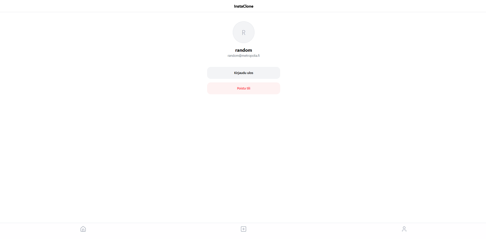
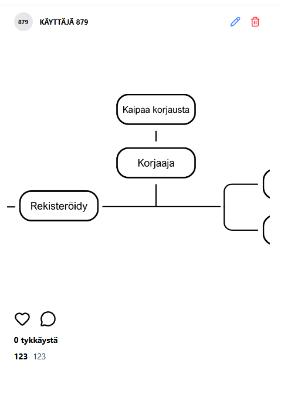
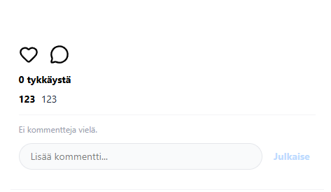

## Toiminnallisuudet
Käyttäjänhallinta: Rekisteröinti, sisäänkirjautuminen ja tilin poistaminen.
Median hallinta: Julkaisujen selaus, tykkäysten lisääminen ja poistaminen (toggle-logiikka) sekä kommenttien lukeminen ja kirjoittaminen. 
Lisäksi käyttäjä voi luoda uusia julkaisuja, muokata omien julkaisujensa otsikoita ja kuvauksia sekä poistaa niitä.

## Tekniikat
Front-end: React, TypeScript, Vite 
Tilanhallinta: Zustand 
Tyylittely: Tailwind CSS, lucide-react
Backend: Metropolia REST API

## Kuvat
Etusivu: 
Profiili: 
Upload: 

Muokkaustila: 

Kommentit: 

## Käyttöönotto
1. Asenna: npm install
2. Konfiguroi .env tiedosto API-osoitteilla
3. Käynnistä sovelus: npm run dev

## Tietokannan kuvaus
**Users:** Käyttäjätiedot ja tunnistautuminen
**Media:** Tiedostojen nimet, otsikot, kuvaukset ja omistajuussuhteet
**Likes:** Julkaisujen ja käyttäjien välinen yhteys

## Back-end-API:
https://media2.edu.metropolia.fi/media-api/api/v1

## API-dokumentaatioon:
[https://media2.edu.metropolia.fi/media-api/](https://media2.edu.metropolia.fi/media-api/)

## Testikäyttäjä
Nimi: random  Pass: random123

## Tekoäly
Logiikan toteutus: kuten rinnakkaiset API-kutsut käyttäjänimien noutamiseen ja 
kaksivaiheinen tiedoston latausprosessi, on tekoälyn avustuksella, lisäksi virheiden korjaamisesta ja sovelluksen ulkoasua
