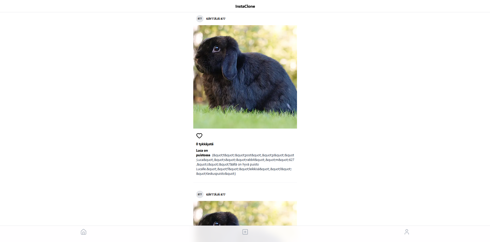
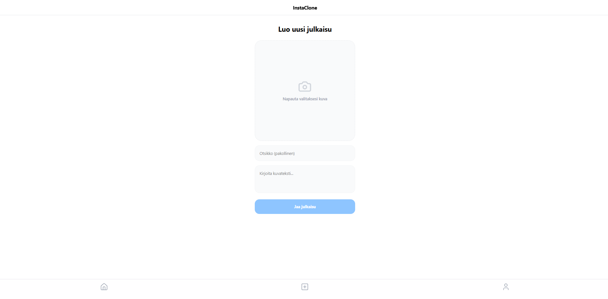

# InstaClone Median jakosovellus

## Toiminnallisuudet
Käyttäjänhallinta: Sisäänkirjautuminen ja tilin poistaminen
Median hallinta: Julkaisujen selaus, omien postausten muokkaus
Vuorovaikutus: Tykkäysten lisääminen ja poistaminen lisääksi käyttäjä voi luoda uusia julkaisuja, 
muokata omien julkaisujensa otsikoita ja kuvauksia sekä poistaa niitä.

## Tekniikat
Front-end: React, TypeScript, Vite 
Tilanhallinta: Zustand 
Tyylittely: Tailwind CSS,
Backend: Metropolia REST API

## Kuvat

 |

## Käyttöönotto
1. Asenna riippuvuudet: npm install
2. Konfiguroi .env tiedosto API-osoitteilla.
3. Käynnistä kehityspalvelin: npm run dev

## Tekoäly
Logiikan toteutus: kuten rinnakkaiset API-kutsut käyttäjänimien noutamiseen ja 
kaksivaiheinen tiedoston latausprosessi, on tekoälyn avustuksella, lisäksi virheiden korjaamisesta.
